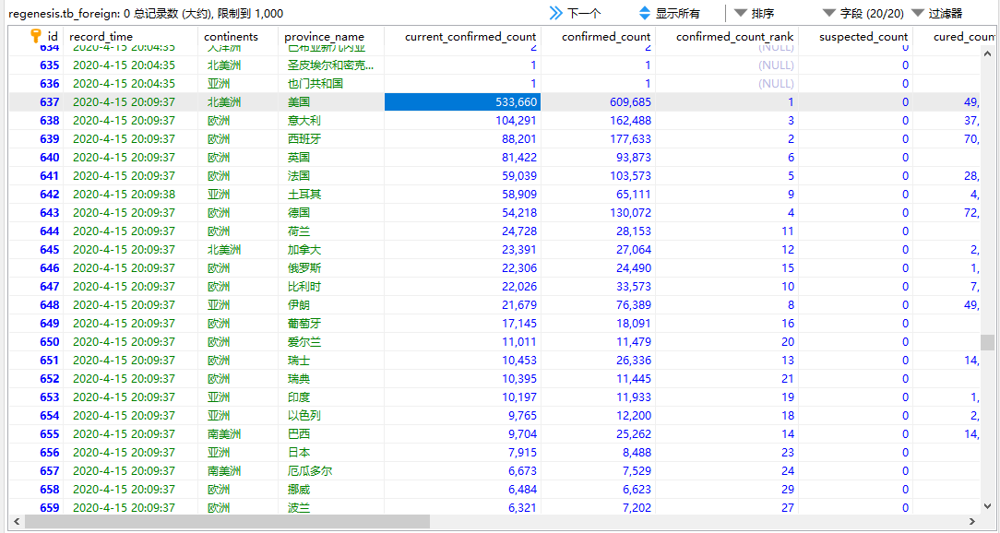

### 新冠肺炎疫情爬虫

#### 实现流程

- 实现
  - SpringBoot
  - MyBatis-Plus
  - Jsoup
  - SpringTask

- 环境
  - idea
  - mysql8
  - jdk8
- 数据来源
  - [全球新冠病毒最新实时疫情地图_丁香园]( https://ncov.dxy.cn/ncovh5/view/pneumonia )

#### 功能

- 数据爬取
  - 各国疫情数据
  - 国内各省疫情数据
  - 城市疫情数据
  - 疫情重点咨讯

- 数据查询
  - 最新数据查询

#### TODO

- 邮件订阅/推送
- 搜索功能
- 集成swagger
- 数据可视化
- 使用Quartz替代SpringTask

#### 爬取结果

